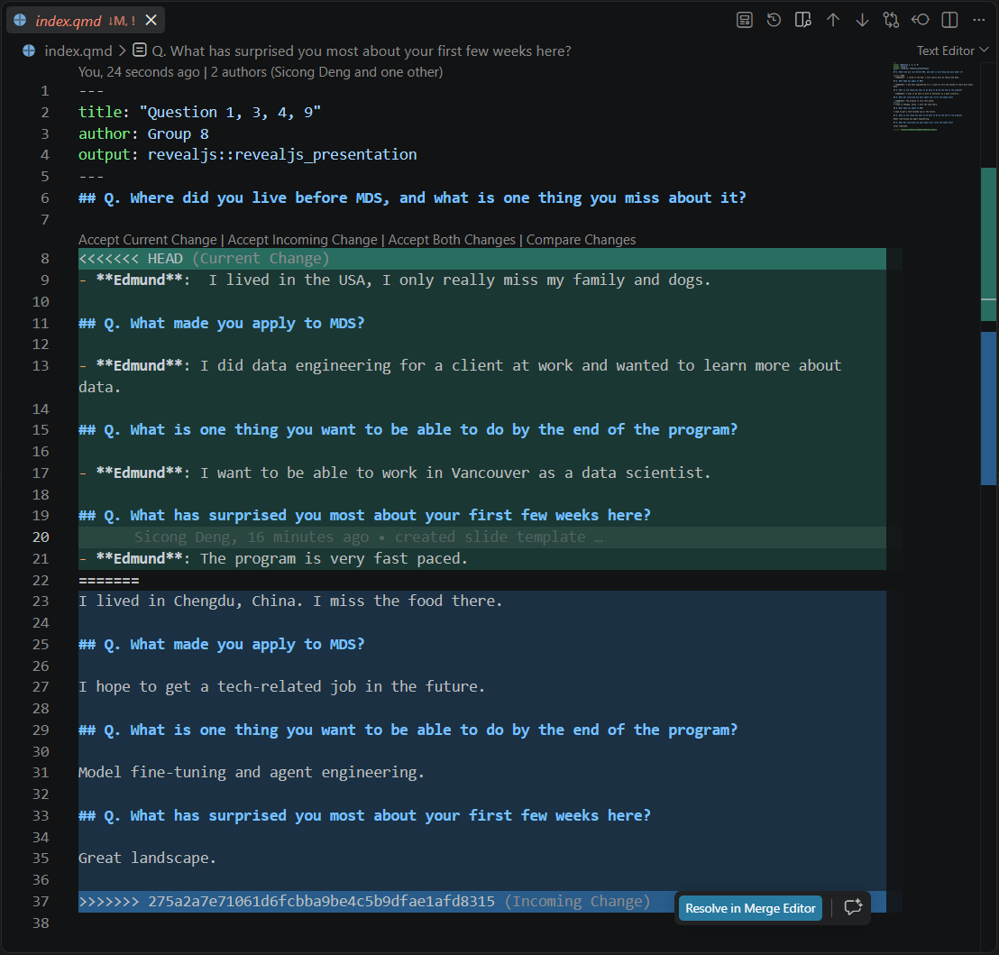

## Q. Where did you live before MDS, and what is one thing you miss about it?

- **Edmund**:  I lived in the USA, I only really miss my family and dogs.

    Xuan: I have being living in Richmond before MDS. I miss the bubble teas there.

I lived in Chengdu, China. I miss the food there.

## Q. What made you apply to MDS?

    Xuan: I applied to MDS because I would like to take a break from my career and explore more trending topics.

- **Edmund**: I did data engineering for a client at work and wanted to learn more about data.

I hope to get a tech-related job in the future.

## Q. What is one thing you want to be able to do by the end of the program?

    Xuan: I wish I could be able to code in Python.

- **Edmund**: I want to be able to work in Vancouver as a data scientist.

Model fine-tuning and agent engineering.

## Q. What has surprised you most about your first few weeks here?

    Xuan: Workload was insane.

- **Edmund**: The program is very fast paced.

Great landscape.

## Xuan Jiang (xuanj)
.jpg){width=500px}
## Edmund Yong (yongez)
{width=500px}
